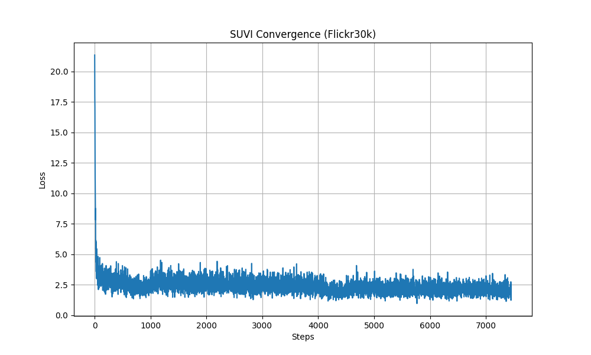
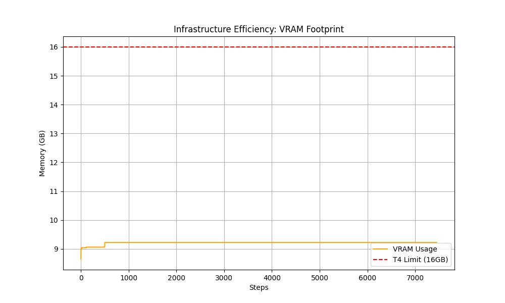

# SUVI: Scalable Unified Vector Intelligence

<p align="center">
  <a href="https://heysuvi.com"></a>
  <a href="https://heysuvi.com/paper"></a>
  <a href="LICENSE"></a>
</p>

<p align="center">
  <b>Official implementation by <a href="https://heysuvi.com">TGU-4187 Heysuvi Labs</a></b><br>
  TTI – Technology Transfer Initiative GmbH, University of Stuttgart
</p>

> 🏆 **Accepted at IEEE Conference on Artificial Intelligence (CAI) 2026**

---

## Overview

SUVI eliminates the need for heavy vision backbones (e.g., CLIP/SigLIP ViT towers) in multimodal LLMs by converting images into discrete token IDs using a frozen Stable Diffusion VAE encoder and a lightweight deterministic discretization (Case B). In our run, this keeps peak allocated VRAM at **~13.55GB (4-bit)**, enabling deployment in the 16GB envelope (e.g., NVIDIA T4).

📖 **Read the full paper**: [heysuvi.com/paper](https://heysuvi.com/paper)

<p align="center">
  
  
</p>

## Key Results

| Metric | SUVI | LLaVA-1.5 | InstructBLIP |
|--------|------|-----------|--------------|
| Visual Component | Frozen SD-VAE tokenizer (no ViT tower) | CLIP-ViT-L | ViT-G/14 |
| Peak Allocated VRAM (4-bit) | **~13.55 GB** | >20 GB (fp16) | >22 GB (fp16) |
| Edge Deployable (T4) | ✅ | ❌ | ❌ |

> Note: VRAM is measured as peak allocated GPU memory during active processing (via `torch.cuda.max_memory_allocated()`).

### Case A (Codebook) Variant

Interested in a Case A tokenizer (codebook-based nearest-neighbor quantization) for research/comparison? Contact **Heysuvi Labs** at **nvyas@heysuvi.com**.

## Installation

```bash
# Clone repository
git clone https://github.com/nakulvyas21/suvi.git
cd suvi

# Create environment
conda create -n suvi python=3.10 -y
conda activate suvi

# Install dependencies
pip install -r requirements.txt
```

## Quick Start

### Training on Flickr30k

```bash
python suvi_train.py
```

### Configuration

All hyperparameters match the paper exactly:

| Parameter | Value |
|-----------|-------|
| Base Model | Mistral-7B-v0.1 |
| Visual Tokenizer | SD-VAE-ft-mse |
| Quantization | 4-bit NF4 |
| LoRA Rank | 16 |
| LoRA Alpha | 32 |
| Learning Rate | 5e-5 |
| Batch Size | 2 (accumulated to 4) |
| Training Steps | 250 |

## Hardware Requirements

- **Training**: NVIDIA A100 40GB (or similar)
- **Inference**: NVIDIA T4 16GB (or any 16GB+ GPU)

## Citation

If you use SUVI in your research, please cite:

```bibtex
@inproceedings{vyas2026suvi,
  title={SUVI: Scalable Unified Vector Intelligence for Efficient Edge Deployment},
  author={Vyas, Nakul},
  booktitle={IEEE Conference on Artificial Intelligence (CAI)},
  year={2026}
}
```

## License

This project is licensed under the Apache License 2.0 - see [LICENSE](LICENSE) for details.

## Links

- 🌐 **Project Page**: [heysuvi.com](https://heysuvi.com)
- 📧 **Contact**: nvyas@heysuvi.com
- 🔬 **ORCID**: [0009-0007-7650-3551](https://orcid.org/0009-0007-7650-3551)

---

<p align="center">
  <b>TGU-4187 Heysuvi Labs</b><br>
  TTI – Technology Transfer Initiative GmbH, University of Stuttgart
</p>
