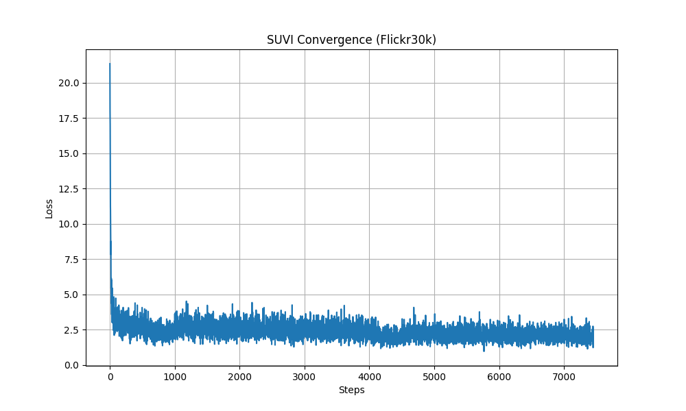
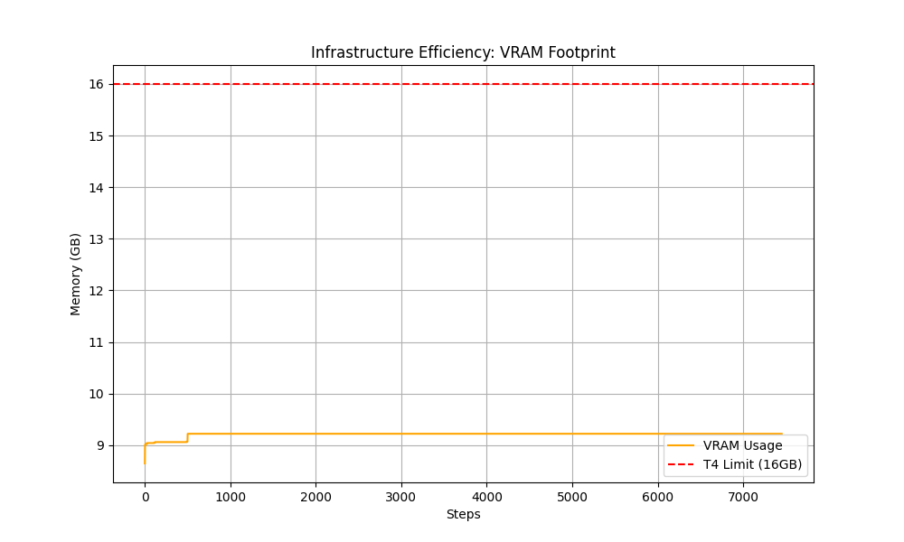

# SUVI: Scalable Unified Vector Intelligence

<p align="center">
  <a href="https://heysuvi.com"></a>
  <a href="https://heysuvi.com/paper"></a>
  <a href="LICENSE"></a>
</p>

<p align="center">
  <b>Official implementation by <a href="https://heysuvi.com">TGU-4187 Heysuvi Labs</a></b><br>
  TTI – Technology Transfer Initiative GmbH, University of Stuttgart
</p>

> 🏆 **Accepted at IEEE Conference on Artificial Intelligence (CAI) 2026**

---

## Overview

SUVI eliminates the need for heavy vision backbones (e.g., CLIP/SigLIP ViT towers) in multimodal LLMs by converting images into discrete token IDs using a frozen Stable Diffusion VAE encoder and a patchwise discretization scheme. The current implementation uses a single autoregressive stream in which image tokens and text tokens are processed by the same Mistral backbone.

This repository is organized as a reproducibility snapshot for the current public SUVI run, paused at **7,451 optimizer steps** on Flickr30k.

Dataset source used in the current scripts:
- `umaru97/flickr30k_train_val_test`

Current measured results on NVIDIA L4:
- Peak allocated training VRAM at 7,451 steps: **~9.22 GB**
- Loaded-model inference memory: **~6.15 GB**
- Peak allocated inference VRAM: **~6.45 GB**

📖 **Read the full paper**: [heysuvi.com/paper](https://heysuvi.com/paper)

<p align="center">
  
  
</p>

## Key Results

| Metric | SUVI | LLaVA-1.5 | InstructBLIP |
|--------|------|-----------|--------------|
| Visual Component | Frozen SD-VAE tokenizer (no ViT tower) | CLIP-ViT-L | ViT-G/14 |
| Peak Training VRAM (4-bit) | **~9.22 GB** | >20 GB (fp16) | >22 GB (fp16) |
| Peak Inference VRAM | **~6.45 GB** | N/A | N/A |
| Single-Stream Early Fusion | ✅ | ❌ | ❌ |

> Note: VRAM is measured as allocated GPU memory via `torch.cuda.memory_allocated()` / `torch.cuda.max_memory_allocated()` in the current scripts.

## Installation

```bash
# Clone repository
git clone https://github.com/nakulvyas21/suvi.git
cd suvi

# Create environment
conda create -n suvi python=3.10 -y
conda activate suvi

# Install dependencies
pip install -r requirements.txt
```

## Quick Start

### Local Training

```bash
python suvi_train.py --max-steps 7451 --checkpoint-interval 250 --output-dir artifacts/suvi_train_latest
```

The training script:
- saves rolling checkpoints in `latest_adapter/`
- saves periodic checkpoints in `checkpoint_step_XXXXX/`
- saves `final_adapter/` at the end
- can be interrupted safely and resumed later

### Headless VM Training With tmux

Start a detached run:

```bash
cd ~/suvi
tmux new -s suvi-500 '.venv/bin/python -u suvi_train.py --max-steps 500 --checkpoint-interval 100 --output-dir artifacts/suvi_train_500 | tee logs/suvi_train_500.log'
```

Detach:

```bash
Ctrl-b d
```

Reattach:

```bash
tmux attach -t suvi-500
```

Stop safely:

```bash
Ctrl-c
```

Resume later from the latest saved checkpoint:

```bash
cd ~/suvi
tmux new -s suvi-500 '.venv/bin/python -u suvi_train.py --max-steps 500 --checkpoint-interval 100 --output-dir artifacts/suvi_train_500 | tee -a logs/suvi_train_500.log'
```

Continue a finished run to a larger total step count:

```bash
cd ~/suvi
tmux new -s suvi-10k '.venv/bin/python -u suvi_train.py --max-steps 10000 --checkpoint-interval 500 --output-dir artifacts/suvi_train_500 | tee -a logs/suvi_train_10k.log'
```

### Reproducing The Published 7,451-Step Plots

The current repository already includes the figures and logs from the public 7,451-step run:

- `figures/suvi_convergence.png`
- `figures/suvi_vram_profile.png`
- `figures/green_ai_chart.png`
- `figures/suvi_inference_vram_7400.png`
- `figures/inference_metrics_7400.json`
- `figures/suvi_train_latest_logs.json`

To regenerate the training plots from a saved `suvi_logs.json` file:

```bash
python plot_suvi.py
```

### Inference

Run single-image inference from a saved adapter:

```bash
python suvi_infer.py \
  --adapter-path artifacts/suvi_train_latest/latest_adapter \
  --dataset-split test \
  --sample-index 0 \
  --max-new-tokens 64 \
  --output-json artifacts/suvi_train_latest/inference_metrics.json \
  --output-plot artifacts/suvi_train_latest/suvi_inference_vram.png
```

### Configuration

All hyperparameters match the paper exactly:

| Parameter | Value |
|-----------|-------|
| Base Model | Mistral-7B-v0.1 |
| Visual Tokenizer | SD-VAE-ft-mse |
| Quantization | 4-bit NF4 |
| LoRA Rank | 16 |
| LoRA Alpha | 32 |
| Learning Rate | 5e-5 |
| Batch Size | 2 (accumulated to 4) |
| Image Tokens per Image | 256 |
| Max Text Length | 512 |
| Training Steps | 7,451 in the current reported run |

## Hardware Requirements

- **Training**: NVIDIA L4 was used for the reported 7,451-step run
- **Inference**: NVIDIA L4 was used for the reported single-image inference measurement; peak allocated inference VRAM was ~6.45 GB

## Citation

If you use SUVI in your research, please cite:

```bibtex
@inproceedings{vyas2026suvi,
  title={SUVI: Scalable Unified Vector Intelligence for Efficient Edge Deployment},
  author={Vyas, Nakul},
  booktitle={IEEE Conference on Artificial Intelligence (CAI)},
  year={2026}
}
```

## License

This project is licensed under the Apache License 2.0 - see [LICENSE](LICENSE) for details.

## Links

- 🌐 **Project Page**: [heysuvi.com](https://heysuvi.com)
- 📧 **Contact**: nvyas@heysuvi.com
- 🔬 **ORCID**: [0009-0007-7650-3551](https://orcid.org/0009-0007-7650-3551)

---

<p align="center">
  <b>TGU-4187 Heysuvi Labs</b><br>
  TTI – Technology Transfer Initiative GmbH, University of Stuttgart
</p>
